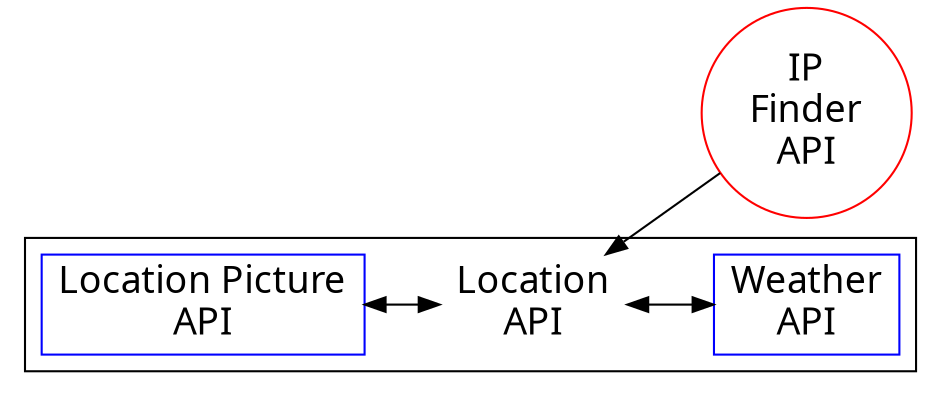

# Location Finder

<!-- https://webahead5.github.io/FaceDetect/ -->
Let's Check the [Website](https://webahead5.github.io/FaceDetect/):heart:
---
The website is built in a way that the weather will be modified according to Your location, So when the user enters the web page the pictures and the weather will be automaticly modified to be his location's.

However, the info will change according the city that you are searching for whenever a valid city name is inserted to the search bar. 

---

### The APIs Work Flow :cyclone:

---

---
:dog:
---

---
The pictures of the locations are randomly picked from [PixaBay's](https://pixabay.com) API According the search key word.

# :100: :muscle: :tada:

---

### Thank you! :sheep: 

