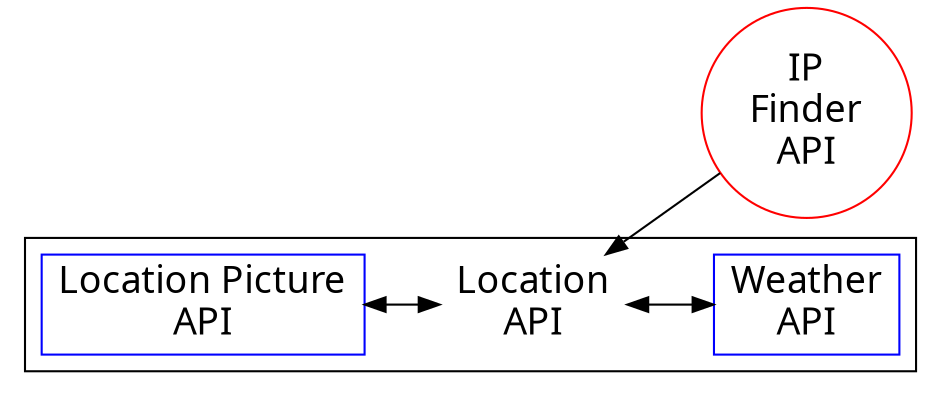

# Location Finder

<!-- https://webahead5.github.io/LocationInfo/ -->
Let's Check the [Website](https://webahead5.github.io/LocationInfo/):heart:
---
The website is built in a way that the weather will be modified according to Your location, So when the user enters the web page the pictures and the weather will be automaticly modified to be his location's.

However, the info will change according the city that you are searching for whenever a valid city name is inserted to the search bar. 

### APIS USED 

- GET USER IP: https://api.ipify.org
- GET LOCATION FROM IP: http://api.ipstack.com/
- GET WEATHER INFO: http://api.openweathermap.org
- GET LOCATION PICTURE: https://api.ipify.org/
- GET LOCATION MAP: https://js.api.here.com
---

### Functionality

Default infomation will be provided based on your current location (based on your IP), and you can type in any City in the search bar to get new information.

### The APIs Work Flow :cyclone:

---

---
:dog:
---

---
The pictures of the locations are randomly picked from [PixaBay's](https://pixabay.com) API According the search key word.

# :100: :muscle: :tada:

---

### Thank you! :sheep: 

